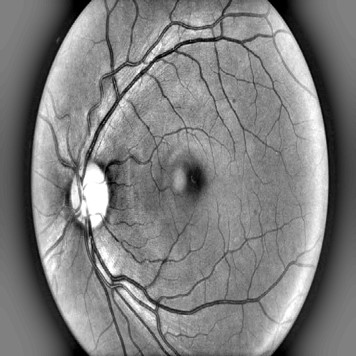
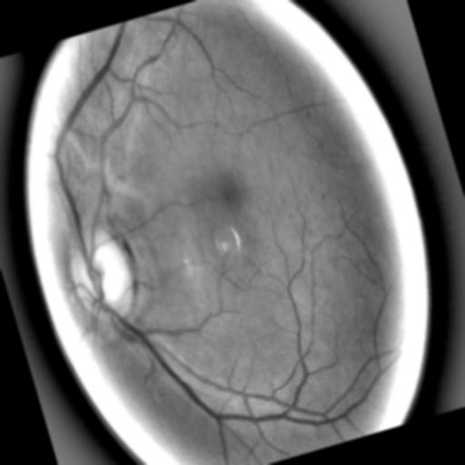
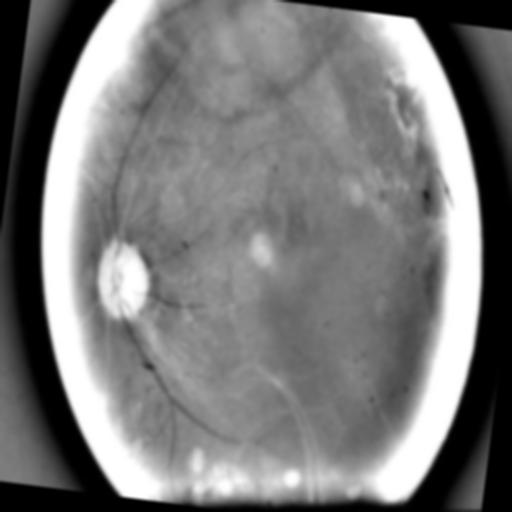

# 👁️ RetinoXAI — Diabetic Retinopathy Detection

<div align="center">


An AI-powered **Diabetic Retinopathy (DR)** detection system using **EfficientNet** with transfer learning and **Explainable AI (XAI)** techniques. The model classifies retinal fundus images into severity stages to assist early clinical diagnosis.

</div>

---

## 📌 Table of Contents

- [Project Overview](#-project-overview)
- [DR Severity Stages](#-dr-severity-stages)
- [Sample Images](#-sample-images)
- [Features](#-features)
- [Tech Stack](#️-tech-stack)
- [Project Structure](#-project-structure)
- [Setup & Usage](#-setup--usage)
- [Model Architecture](#-model-architecture)
- [Explainability (XAI)](#-explainability-xai)
- [Results](#-results)
- [Contributing](#-contributing)
- [Author](#️-author)
- [License](#-license)

---

## 🌐 Project Overview

**Diabetic Retinopathy** is a leading cause of blindness globally, affecting millions of diabetic patients. Early detection is critical — yet manual grading of retinal images by specialists is time-consuming and expensive.

**RetinoXAI** addresses this by automating retinal image classification using a fine-tuned **EfficientNet** deep learning model combined with **Explainable AI** techniques, making predictions transparent and clinically interpretable.

> 🏥 *Empowering early diagnosis through explainable deep learning.*

---

## 🔬 DR Severity Stages

The model classifies retinal fundus images into the following internationally recognized DR severity levels:

| Stage | Label | Description |
|---|---|---|
| 0 | ✅ No DR | No signs of diabetic retinopathy |
| 1 | 🟡 Mild | Microaneurysms only |
| 2 | 🟠 Moderate | More than microaneurysms but less than severe |
| 3 | 🔴 Severe | Extensive haemorrhages in all 4 quadrants |
| 4 | ☠️ Proliferative | Neovascularization or vitreous haemorrhage |

---

## 🖼️ Sample Images

Below are example retinal fundus images from the dataset used for classification:

| No DR | Moderate | Proliferative |
|---|---|---|
|  |  |  |

---

## 🧠 Features

| Feature | Description |
|---|---|
| 🔍 Multi-class Classification | Detects 5 stages of diabetic retinopathy severity |
| ⚡ EfficientNet Backbone | High accuracy with fewer parameters via transfer learning |
| 🧩 Explainable AI (XAI) | Visual heatmaps (Grad-CAM) show model focus regions |
| 📊 Training Notebooks | Two full experiment notebooks included |
| 🏥 Clinical Relevance | Aligned with international DR grading standards |

---

## 🛠️ Tech Stack

| Technology | Role |
|---|---|
| Python 3.8+ | Core programming language |
| EfficientNet (Keras/TF) | Pre-trained CNN backbone for transfer learning |
| TensorFlow / Keras | Deep learning framework |
| Grad-CAM / XAI | Explainability and visual saliency maps |
| NumPy / Pandas | Data manipulation and preprocessing |
| Matplotlib / Seaborn | Visualization and results plotting |
| Jupyter Notebook | Experiment environment |

---

## 📂 Project Structure

```
RetinoXAI-DR-Detection/
│
├── efficient-net-trans (4).ipynb     # Experiment v1 — baseline EfficientNet model
├── efficient-net-trans (11).ipynb    # Experiment v2 — tuned model with XAI
│
├── No_DR.jpeg                        # Sample: No Diabetic Retinopathy
├── Moderate.jpeg                     # Sample: Moderate DR stage
├── Proliferative.jpeg                # Sample: Proliferative DR stage
│
├── .gitignore
├── LICENSE
└── README.md
```

---

## 🚀 Setup & Usage

### Prerequisites

- Python 3.8 or higher
- Jupyter Notebook or JupyterLab
- GPU recommended *(Google Colab works great)*

---

### 1. Clone the Repository

```bash
git clone https://github.com/Fasih-Satti/RetinoXAI-DR-Detection.git
cd RetinoXAI-DR-Detection
```

### 2. Install Dependencies

```bash
pip install tensorflow keras numpy pandas matplotlib seaborn opencv-python
```

### 3. Open the Notebook

```bash
jupyter notebook
```

Then open either:
- `efficient-net-trans (4).ipynb` — baseline experiment
- `efficient-net-trans (11).ipynb` — improved model with XAI

### 4. Run on Google Colab *(Recommended)*

Click the badge below to open directly in Colab:

[](https://colab.research.google.com/github/Fasih-Satti/RetinoXAI-DR-Detection/blob/main/efficient-net-trans%20(11).ipynb)

---

## 🏗️ Model Architecture

```
Input Image (224×224×3)
        ↓
EfficientNet-B0  (pre-trained on ImageNet)
        ↓
Global Average Pooling
        ↓
Dense Layer (512 units, ReLU)
        ↓
Dropout (0.5)
        ↓
Output Layer (5 classes, Softmax)
        ↓
DR Stage Prediction
```

- **Backbone:** EfficientNet-B0 (weights frozen initially, then fine-tuned)
- **Loss Function:** Categorical Cross-Entropy
- **Optimizer:** Adam with learning rate scheduling
- **Augmentation:** Random flips, rotations, zoom, brightness adjustments

---

## 🔍 Explainability (XAI)

To build clinical trust, **Grad-CAM** (Gradient-weighted Class Activation Mapping) is applied to highlight which regions of the retinal image most influenced the model's prediction.

```
Retinal Image → Model Prediction → Grad-CAM Heatmap → Overlay Visualization
```

This helps clinicians understand *why* the model made a specific classification, making it suitable for assistive diagnostic use.

---

## 📊 Results

> Results from the best-performing notebook (`efficient-net-trans (11).ipynb`):

| Metric | Score |
|---|---|
| Training Accuracy | *See notebook* |
| Validation Accuracy | *See notebook* |
| Test Accuracy | *See notebook* |
| AUC-ROC | *See notebook* |

> 📝 Full confusion matrix, classification report, and Grad-CAM visualizations are available inside the notebooks.

---

## ⚠️ Disclaimer

This project is intended for **research and educational purposes only**. It is **not a certified medical device** and should not be used as a substitute for professional medical diagnosis. Always consult a qualified ophthalmologist for clinical decisions.

---

## 🤝 Contributing

Contributions, issues, and improvements are welcome!

1. Fork the repository
2. Create your branch: `git checkout -b feature/your-feature`
3. Commit your changes: `git commit -m 'Add your feature'`
4. Push: `git push origin feature/your-feature`
5. Open a [Pull Request](https://github.com/Fasih-Satti/RetinoXAI-DR-Detection/pulls)

---

## 🙋‍♂️ Author

**Fasih Ur Rehman**

[](https://github.com/Fasih-Satti)

---

## 📄 License

This project is licensed under the **MIT License** — see the [LICENSE](LICENSE) file for details.

---

<div align="center">
Made with ❤️ by <a href="https://github.com/Fasih-Satti">Fasih Ur Rehman</a><br/>
<i>Using AI to protect sight, one retina at a time.</i>
</div>
